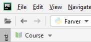
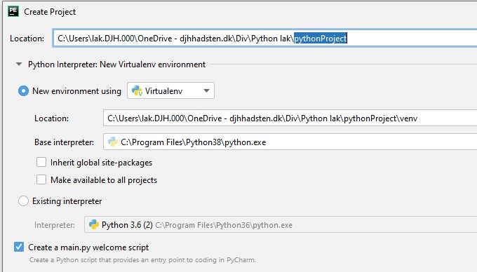

Skriv en program der kan følgende ting:

<li>Udskriv en besked af eget valg
<li>Tilføj # efter den ovenstående besked
<li>Udskriv en multiline streng
<li>Benyt kommadoen input til at udskrive et indtastet tal mellem 1-100

For at oprette et nyt projekt og py file skal man:

Tryk på "File/New Project" og give den et navn.
    
        
------------

    
    
 Placere cursoren ved "Projektnavn" og højre klik, vælg "New/Python file".
    

