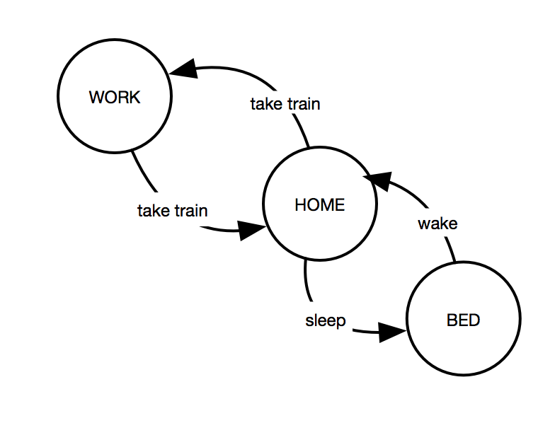

Livets_gang_evighed.py er et program der viser livet ved hjælp af 3 states.

<li>Færdigøre programmet så det viser en person der står op om morgen går på arbejde tager hjem gå i seng og står op igen osv.</li>
<li>Livets_gang_begrænset.py skal statemachinen have en begrænsning så efter et antal genneme af statene stopper programmet.</li>

Tilføj weekend(2 dage) til "Livets gang!!"
