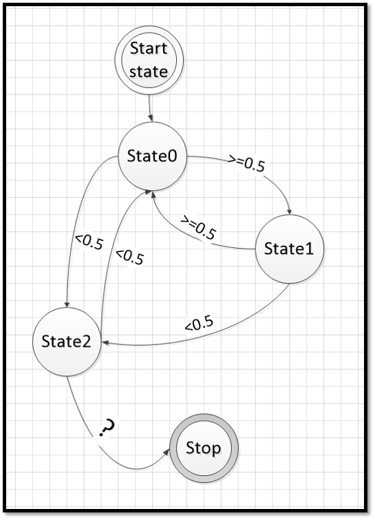

En statemachine er en måde at beskrive komplicerede strukturere på en simple måde.

Dette eksemple viser et program med 3 states, hvor en random generator afgøre hvilket state der skal hoppes til.

Statemachinen til "Simpel_statemachine.py" er vist nendenfor. 

